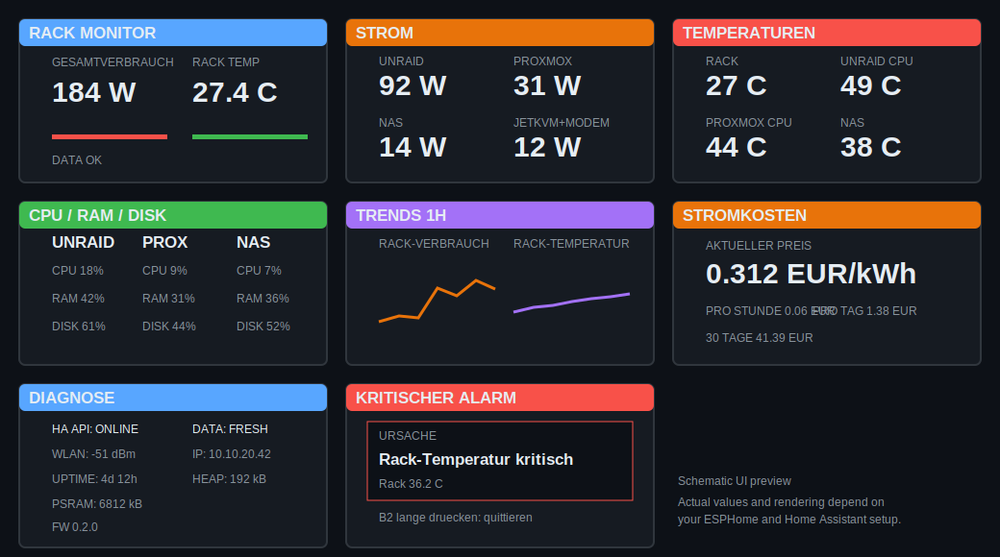

# ESP Rack Monitor

ESPHome rack-monitoring firmware for a **LilyGO T-Display-S3**. It presents Home Assistant metrics on a compact 320 × 170 display and exposes display, alarm and threshold controls back to Home Assistant.



## Features

- Eight selectable pages: overview, power, temperatures, systems, one-hour trends, electricity costs, diagnostics and hardware test
- Robust per-cause alarm state machine with startup grace, trigger delay, clear delay and hysteresis
- Multiple simultaneous alarm and warning reasons instead of only the first cause
- A newly appearing alarm cause reopens the alarm page even after earlier causes were acknowledged
- Persistent Home Assistant controls for thresholds, brightness, rotation, delays and alarm groups
- Four freely named host slots with enable switches and automatic hiding of unavailable cards
- Empty data pages can be skipped automatically during rotation
- Manual button or HA page selection pauses auto-rotation for a configurable time
- Dedicated test page for display colors, B1/B2, API and data-feed state
- Time-based or optional sun-based night dimming
- One-hour in-memory graphs with explicit grid spacing and no repeated graph-scale warnings
- Current electricity price, live cost rate, projection and optional actual daily cost
- Diagnostic data: HA API, heartbeat age, Wi-Fi, IP, uptime, heap, PSRAM, loop time, firmware version and source ref
- Authenticated local web UI, encrypted native API and password-protected native OTA
- One-file installation through the ESPHome dashboard
- Pinned ESPHome builds, weekly compatibility checks, workflow linting and automated dependency updates

## Installation through Home Assistant

Only **one YAML file** must be copied into ESPHome:

1. Open **ESPHome** in Home Assistant.
2. Create a new device or open the YAML editor of the existing Rack Monitor.
3. Copy the complete contents of [`esp-rack-monitor.yaml`](esp-rack-monitor.yaml) into the editor.
4. Adjust the Home Assistant entity IDs and the four host labels in `substitutions`.
5. Validate and install the configuration.

ESPHome downloads the implementation and display-helper library automatically from this repository. No local `packages/`, `includes/` or repository checkout is required. Internet access is required while compiling.

The following entries must exist in the global ESPHome `secrets.yaml`:

```yaml
wifi_ssid: "YOUR_WIFI"
wifi_password: "YOUR_WIFI_PASSWORD"
fallback_ap_password: "A_LONG_FALLBACK_PASSWORD"
api_encryption_key: "YOUR_DEVICE_API_KEY"
ota_password: "A_LONG_OTA_PASSWORD"
web_server_username: "admin"
web_server_password: "A_LONG_WEB_PASSWORD"
```

A matching template is available in [`secrets.example.yaml`](secrets.example.yaml).

## Updating from 0.2.x

Version 0.3.0 keeps all existing entity substitutions for compatibility, but the local one-file installer should be copied again so that the new host labels, sun entity, actual-cost entity and runtime defaults are visible in your ESPHome YAML.

After replacing the YAML:

1. Select **Clean Build Files** in ESPHome.
2. Validate.
3. Install by OTA or USB.
4. Review the newly created configuration entities in Home Assistant.

Existing threshold and brightness values are used as the initial values. Afterwards, changes made through the Home Assistant number entities are retained in flash and no recompilation is needed.

## Host slots

The existing internal sensor IDs remain compatible, while the labels are generic:

| Slot | Default label | Typical use |
|---|---|---|
| Host 1 | `UNRAID` | Main server |
| Host 2 | `PROXMOX` | Hypervisor |
| Host 3 | `NAS` | Storage appliance |
| Host 4 | `JETKVM+MODEM` | Power-only auxiliary devices |

Change `host_1_name` through `host_4_name` in `esp-rack-monitor.yaml`. Each slot also has an enable switch in Home Assistant. Disabled or unavailable entries are hidden from the cards, and empty pages can be skipped automatically.

## Alarm behavior

Critical conditions do not immediately force the alarm page. The defaults are:

- 60-second startup grace for connection and offline checks
- 20-second continuous trigger delay
- 60-second continuous clear delay
- 2 °C temperature hysteresis
- 15 W power hysteresis
- 5 percentage-point utilization hysteresis

Warnings are shown immediately in the header and overview. Critical causes are tracked independently. Acknowledging an alarm only acknowledges the causes active at that moment; a new cause reopens the alarm page.

Alarm groups can be enabled separately:

- Home Assistant connection and stale heartbeat
- Hosts offline
- Rack power
- Temperatures
- CPU, RAM and disk utilization

Use the **Alarm testen** button to generate a local test alarm for one minute.

## Runtime controls

Home Assistant exposes persistent controls for:

- rotation interval and post-interaction pause
- day/night brightness and night start/end hours
- optional night mode based on `sun.sun`
- rack temperature warning/critical values
- rack power warning/critical values
- server and NAS temperature limits
- CPU, RAM and disk warning/critical values
- trigger delay, clear delay and startup grace
- temperature, power and utilization hysteresis
- host visibility, empty-page skipping and alarm groups
- default page and restoration of the last page

## Controls

| Control | Behavior |
|---|---|
| B1 short | Next available page |
| B1 long | Previous page |
| B2 short | Toggle auto rotation; during an active alarm it only wakes the display |
| B2 hold | Acknowledge the currently active alarm causes |
| HA page select | Jump directly to any page |
| HA start-page select | Choose startup page when last-page restore is disabled |
| HA alarm test | Generate a one-minute test alarm |

Manual navigation pauses automatic rotation using the configured pause duration. The hardware test page is available manually but is not included in automatic rotation.

## Home Assistant package

The optional [`home-assistant/esp-rack-monitor-package.yaml`](home-assistant/esp-rack-monitor-package.yaml) provides:

- heartbeat-based stale-feed detection
- an instantaneous cost-rate sensor
- integrated and daily-reset actual cost sensors
- persistent critical-alarm notifications
- scripts for acknowledgement and test alarm

A ready-to-paste dashboard card is available in [`home-assistant/lovelace-card.yaml`](home-assistant/lovelace-card.yaml). Adjust generated entity IDs if your device name differs.

## Update channels

The installer uses `rack_monitor_library_ref` for both remote packages and the helper library:

- `main`: newest tested development state
- `vX.Y.Z`: fixed release version

The device exposes the configured ref and project version as diagnostic text sensors. A mismatched release tag creates a warning. See [Update strategy](docs/UPDATES.md).

## Configuration documentation

- [Home Assistant entities](docs/ENTITIES.md)
- [Thresholds and alarm timing](docs/THRESHOLDS.md)
- [Update strategy](docs/UPDATES.md)
- [Hardware and pinout](docs/PINOUT.md)

## CI and releases

Pull requests compile the exact one-file installer against the pull-request branch. This validates Remote/Git Package loading, the helper library, full firmware generation and artifact staging. A scheduled workflow also compiles against the latest ESPHome release.

Tagged releases are source-only because every installation uses individual credentials and Home Assistant entities.

## License

MIT — see [LICENSE](LICENSE).
